# 🌟 Customer Lifetime Value (CLV) Prediction & Strategic Retention System

### *Enterprise-Grade Analytics Platform Built with Streamlit, XGBoost, and Real-Time Monitoring*

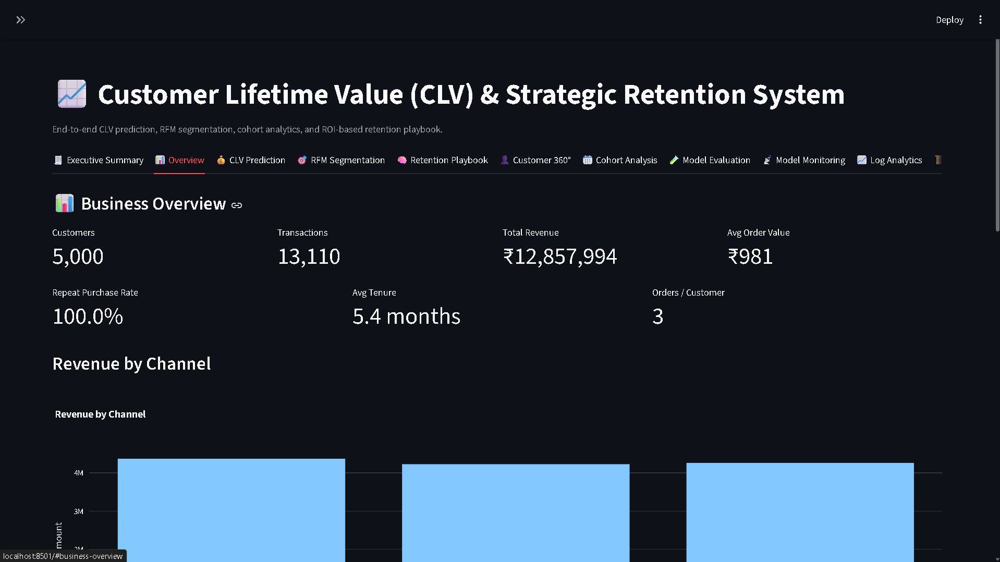

---

# 🖼️ Project Overview

This project is a **production-grade, end-to-end Customer Intelligence Platform** designed to mirror internal analytics systems used at enterprise companies such as **Amazon, Flipkart, Swiggy, Meesho, Uber, and Netflix** and modern e-commerce platforms.

It combines:

* 🔮 **CLV Forecasting with XGBoost**
* 🎯 **RFM Segmentation & Behavioral Personas**
* 📆 **Cohort Retention Analysis**
* 🧠 **ROI-Based Retention Playbook**
* 🧍 **Customer 360° View**
* 📡 **Model Drift Monitoring (PSI + KS)**
* 🔄 **Auto-Retraining Pipeline & Model Registry**
* 📜 **Real-Time Logs Viewer + Log Analytics**
* 🖥️ **System Health Dashboard & Diagnostics**
* 🧾 **Executive PDF Summary Generator**
* 📊 **Interactive Streamlit UI (13 Professional Tabs)**


This project demonstrates strong skills across **Analytics, Machine Learning, Product Strategy, and MLOps**, making it ideal for roles like:

* Product Analyst
* Data Analyst / Business Analyst
* Growth Analyst
* Data Scientist
* ML Engineer / MLOps Engineer

---


# 🏷️ Badges


---


# 🧬 System Architecture

```
Raw Data → Preprocess → Feature Store

Feature Store → XGBoost CLV Model → Retention Engine
Streamlit UI ← Model Outputs & Monitoring
```

---


# 🧭 **Dashboard Sections (13 Tabs)**
> This application includes **13 enterprise-grade Streamlit tabs** designed for actionable customer intelligence and lifecycle analytics.


---


# 1️⃣ 🧾 **Executive Summary**


### High-level business overview extracted from CLV, RFM, cohorts, personas & churn models.


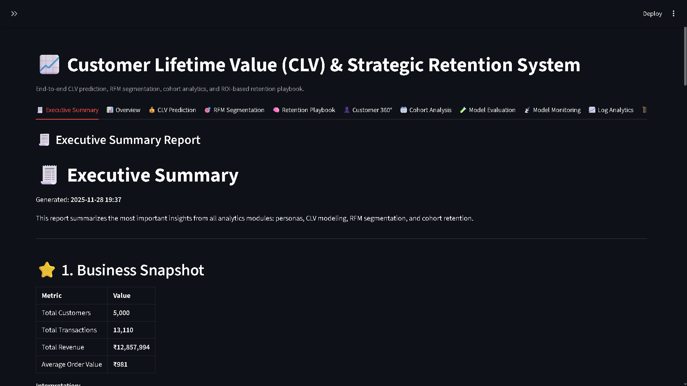


**Includes:**

* Total customers & revenue
* CLV overview
* Top segments & personas
* Retention trends
* Key churn indicators
* Strategic recommendations


🎯 Perfect for leadership & presentations.


---


# 2️⃣ 📊 **Overview**


### High-level business dashboard summarizing your entire customer base.


**Metrics include:**

* Total customers
* Total revenue
* Transactions
* Average Order Value (AOV)
* Repeat purchase rate
* Average tenure
* Orders per customer


**Visuals:**

* Revenue by channel
* Revenue by category
* Monthly revenue trend


🎯 Executive summary of business performance.


---


## 3️⃣ 💰 CLV Prediction


### Predict each customer’s **future lifetime value** using a log-transformed XGBoost model.


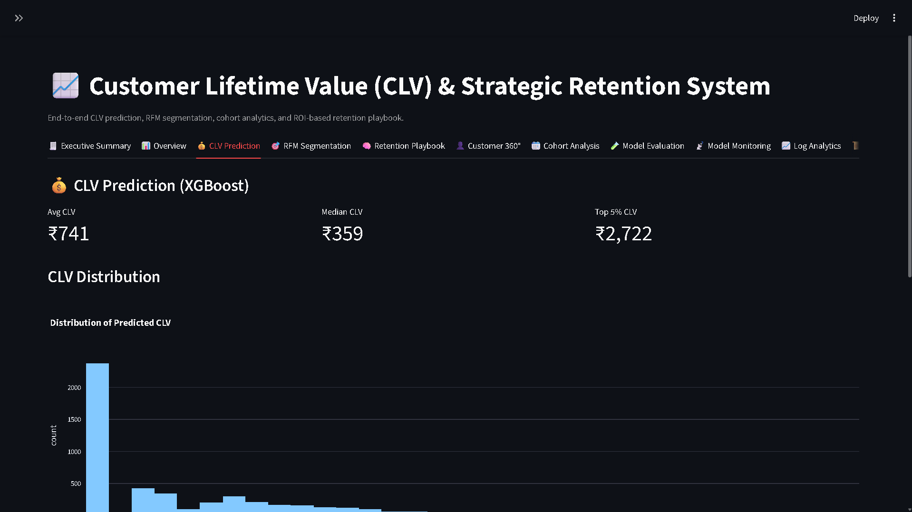


**Displays:**

* Average & median CLV
* Top 5% CLV
* CLV distribution histogram
* Top N customers ranked by CLV


🎯 Helps identify and invest in future high-value customers.


---


## 4️⃣ 🎯 RFM Segmentation


### Behavioral segmentation using Recency, Frequency & Monetary behavior.


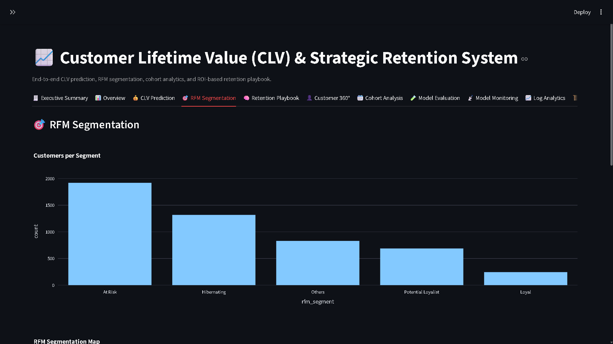


**Outputs:**

* RFM scores
* RFM segment labels
* Bubble chart (Frequency vs Monetary with CLV proxy)
* Segment-level counts


🎯 Foundation for retention, personalization & targeting.


---


## 5️⃣ 🧠 Retention Playbook


### Automated ROI-based retention engine.


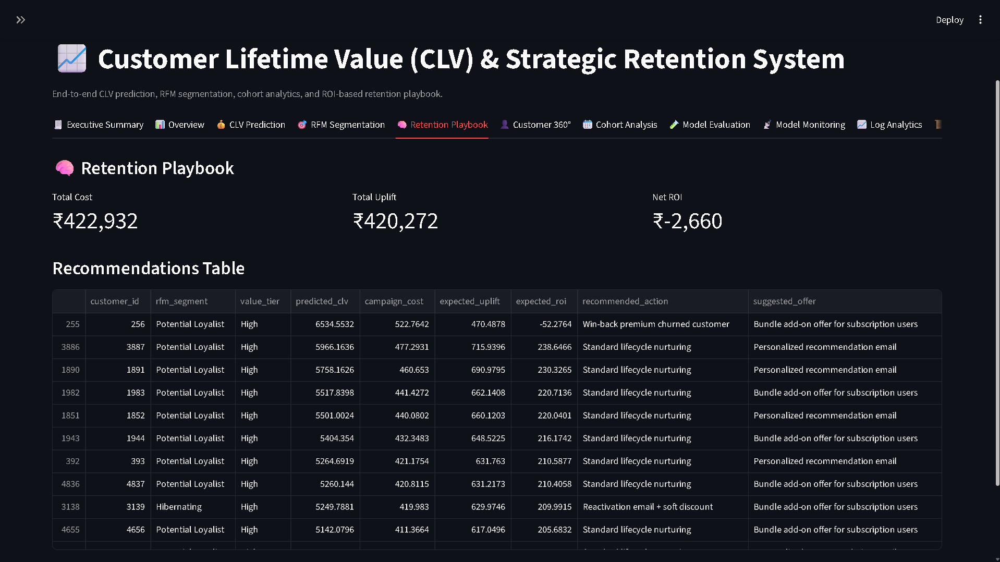


**Includes:**

* Value tier classification
* Segment-specific actions
* Expected uplift (₹)
* Campaign cost (₹)
* Net ROI


🎯 Helps determine **who to target**, **how to target**, and **why**.


---

## 6️⃣ 👤 Customer 360°


### Full lifecycle view of a single customer.


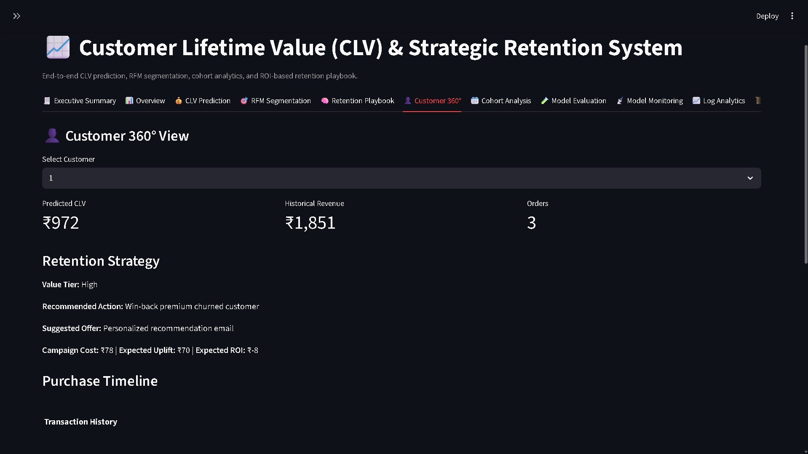


**Includes:**

* Predicted CLV
* Total historical revenue
* RFM details
* Persona information
* Recency, frequency & tenure
* Transaction timeline
* Raw transaction history


🎯 Great for CRM, personalization & deep-dive analysis.


---


## 7️⃣ 📆 Cohort Analysis


### Month-over-month customer retention trends.


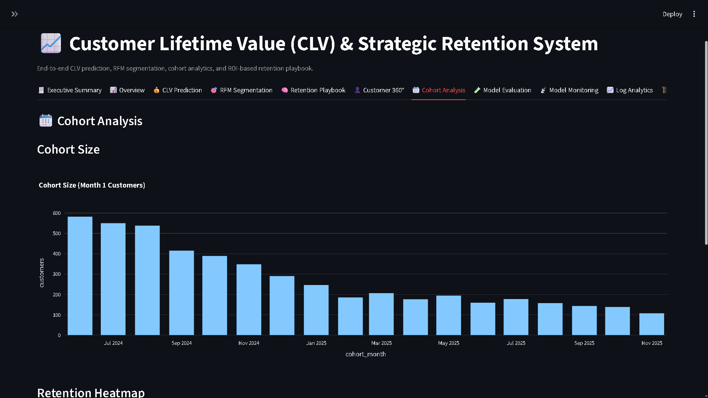


**Includes:**

* Initial cohort sizes
* Retention heatmap
* Cohort decay visualization


🎯 Reveals long-term customer behavior & churn patterns.


---


## 8️⃣ 🧪 Model Evaluation


### ML performance diagnostics & interpretability tools.


**Visuals:**

* Actual vs predicted CLV scatter
* Residual distribution
* Feature importance
* SHAP impact analysis (if enabled)


🎯 Ensures your CLV model is accurate & trustworthy.


---


## 9️⃣ 📡 Model Monitoring


### Enterprise-grade ML monitoring & retraining.


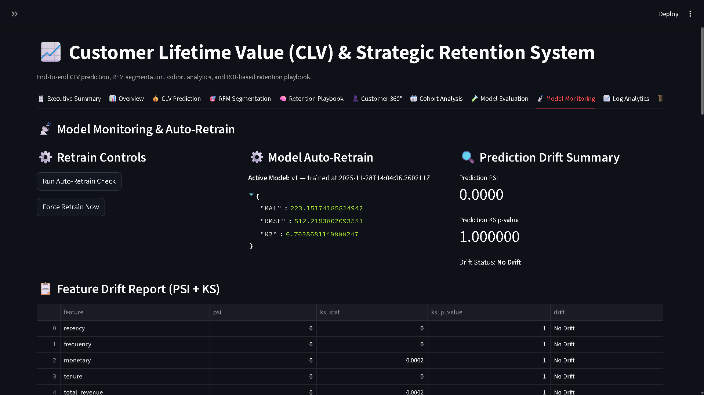


**Checks:**

* Prediction drift (PSI, KS-test)
* Feature drift
* Baseline health
* Auto-baseline snapshot
* Auto-retrain trigger
* Active model version


🎯 Prevents model performance degradation over time.


---


## 🔟 📈 Log Analytics


### Converts logs into actionable insights.


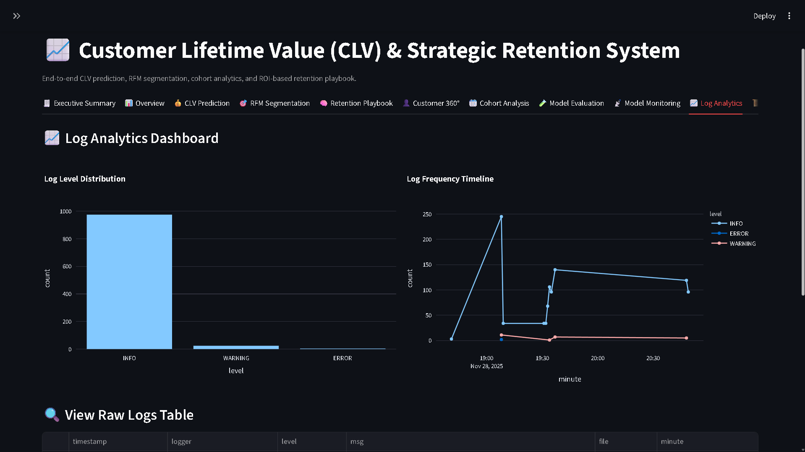


**Includes:**

* Log volume timeline
* Error severity breakdown
* Error spike detection
* Hour-of-day heatmap
* Keyword frequency


🎯 Helps track errors, anomalies & operational issues.


---

## 1️⃣1️⃣ 📜 Logs Viewer


### Real-time developer console for log browsing.


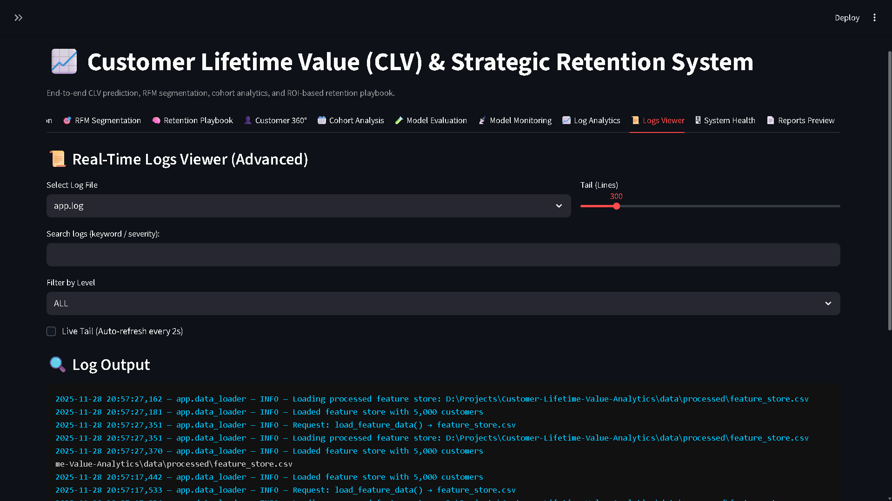


**Features:**

* Live auto-refresh tail
* Keyword search
* Severity filtering
* Dark-mode syntax colors
* Download logs
* Download ZIP of all logs


🎯 Fastest debugging experience inside Streamlit.


---


## 1️⃣2️⃣ 🖥 System Health


### Complete operational readiness report.


**Includes:**

* CPU, RAM, Disk usage
* Dependency health
* Model registry status
* Feature store validation
* Drift status summary
* Pipeline readiness indicators


🎯 Ensures all systems are ready for production.


---


## 1️⃣3️⃣ 📄 **Reports Preview**


### PDF & Markdown analytics report viewer.


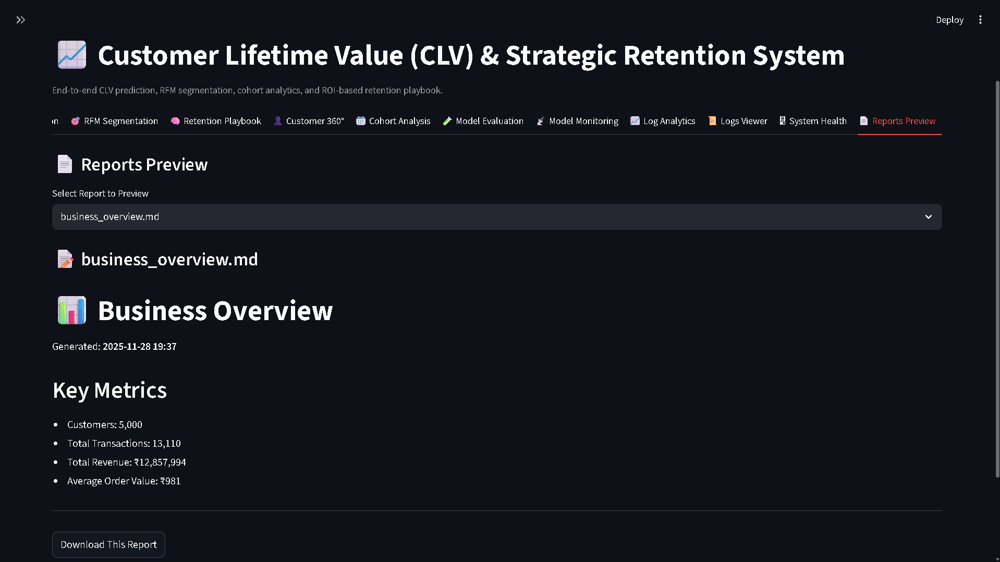


**Features:**

* Executive summary PDF preview
* CLV & retention PDF report
* Persona & cohort visuals
* ZIP export for reports
* Regenerate reports button


🎯 Perfect for exporting insights to leadership.


---


# 📁 **Folder Structure**

```
Customer-Lifetime-Value-Analytics/
│
├── app/
│   ├── auto_retrain.py
│   ├── clv_model.py
│   ├── cohort_analysis.py
│   ├── data_loader.py
│   ├── drift_simulator.py
│   ├── generate_reports.py
│   ├── log_analytics.py
│   ├── logging_config.py
│   ├── log_utils.py
│   ├── model_evaluation.py
│   ├── model_monitoring.py
│   ├── model_registry.py
│   ├── monitoring_viz.py
│   ├── pdf_generator.py
│   ├── preprocess.py
│   ├── retention_recommender.py
│   ├── rfm_segmentation.py
│   ├── streamlit_app.py
│   ├── system_health.py
│   └── utils.py
│
├── data/
│   ├── config/
│   │   └── synthetic_config.py
│   ├── raw/
│   ├── processed/
│   └── synthetic_generator.py
│
├── logs/
│
├── models/
│
├── reports/
│   ├── business_insights.md
│   ├── clv_summary.md
│   ├── executive_summary.md
│   ├── executive_summary.pdf
│   ├── persona_insights.md
│   └── rfm_report.md
│
├── screenshots/
│
├── tests/
│   ├── conftest.py
│   ├── test_clv_model.py
│   ├── test_cohort.py
│   ├── test_data_loader.py
│   ├── test_evaluation.py
│   ├── test_model_evaluation.py
│   ├── test_model_monitoring.py
│   ├── test_monitoring.py
│   ├── test_preprocess.py
│   ├── test_recommender.py
│   ├── test_reports.py
│   └── test_rfm.py
│   
├── requirements.txt
└── README.md
```

---


# ⚙️ **Installation**

### 1️⃣ Clone

```bash
git clone https://github.com/girishshenoy16/Customer-Lifetime-Value-Analytics
cd Customer-Lifetime-Value-Analytics
```

## 2️⃣ Create Virtual Environment

```bash
python -m venv venv
venv\Scripts\activate  # Windows
```


## 3️⃣ Install Dependencies

```bash
python.exe -m pip install --upgrade pip
pip install -r requirements.txt
```

## 4️⃣ **Generate Synthetic Data**

```bash
python data/synthetic_generator.py
```

## 5️⃣ Run Streamlit App

```bash
streamlit run app/streamlit_app.py
```

---


# 🧬 **Data Workflow (Full Pipeline)**

The pipeline is **fully automated** and can be run through Streamlit or command line.

The pipeline follows a **3-stage production pipeline**.

---

# 1️⃣ **Generate Synthetic Data**

*(Required before everything else)*

```
python data/synthetic_generator.py
```

This produces:

* `data/raw/customers_transactions.csv`
* `data/processed/customer_status.csv`
* `data/processed/cart_events.csv`

---

# 2️⃣ **Open Streamlit → Run Preprocessing**


Inside the sidebar (refer below):


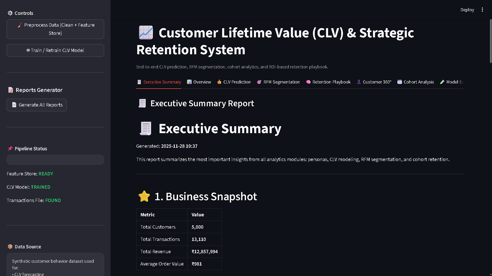


```
🧹 Preprocess Data (Clean + Feature Store)
```

This generates:

* `data/processed/feature_store.csv`
* `data/processed/rfm_dataset.csv`

It performs:

✔ Cleaning
✔ Date normalization
✔ Feature engineering
✔ Customer personas
✔ Subscription features
✔ Cross-sell + cart conversion metrics
✔ Target `future_clv`
✔ Saves Feature Store
✔ Logging

---

# 3️⃣ **Train the CLV Model**

Inside sidebar:

```
🤖 Train / Retrain CLV Model
```

Saves:

```
models/clv_xgboost.pkl
models/scaler.pkl
models/model_registry.json
```

Computes:

* MAE
* RMSE
* R²
* Log-space stability

---

# 4️⃣ **Generate Reports (Recommended Before Deployment)**

Inside Streamlit:

```
📄 Reports Preview → Generate Reports
```

Or from terminal:

```
python app/generate_reports.py
```

Generates:

```
reports/
    business_overview.md
    clv_summary.md
    executive_summary.md
    executive_summary.pdf
    persona_insights.md
    rfm_report.md
```

---

# 🧪 Testing (PyTest Suite)

Run all tests:

```
pytest -q
```

### Tests include:

### ✔ Data pipeline tests

* test_load_transactions
* test_preprocess_pipeline_runs

### ✔ ML model tests

* test_clv_model_training
* test_model_prediction
* test_load_model

### ✔ RFM tests

* test_rfm_segment_counts
* test_rfm_scores

### ✔ Persona analysis tests

* test_persona_distribution
* test_persona_charts_created

### ✔ Monitoring tests

* test_baseline_snapshot
* test_prediction_drift
* test_feature_drift

### ✔ Recommender tests

* test_recommendations_exist
* test_recommendation_logic

All tests run fast (< 5 secs) and validate the core system.

---


# 🚀 **Future Enhancements**

* Deep learning CLV (TabNet / CatBoost)
* MLflow integration / MLflow Tracking 
* API-based real-time scoring (FastAPI)
* Real-time streaming events
* Segmentation-driven pricing
* Pricing elasticity models
* Multivariate uplift modeling
* Realtime incremental learning
* Automated data quality checks
* Auto-ETL scheduler