# 🌟 Customer Value Intelligence & AI-Powered Retention Strategy System

### AI-Powered Customer Intelligence System • CLV Analytics • RFM Segmentation • Retention Intelligence

---

<div align="center">

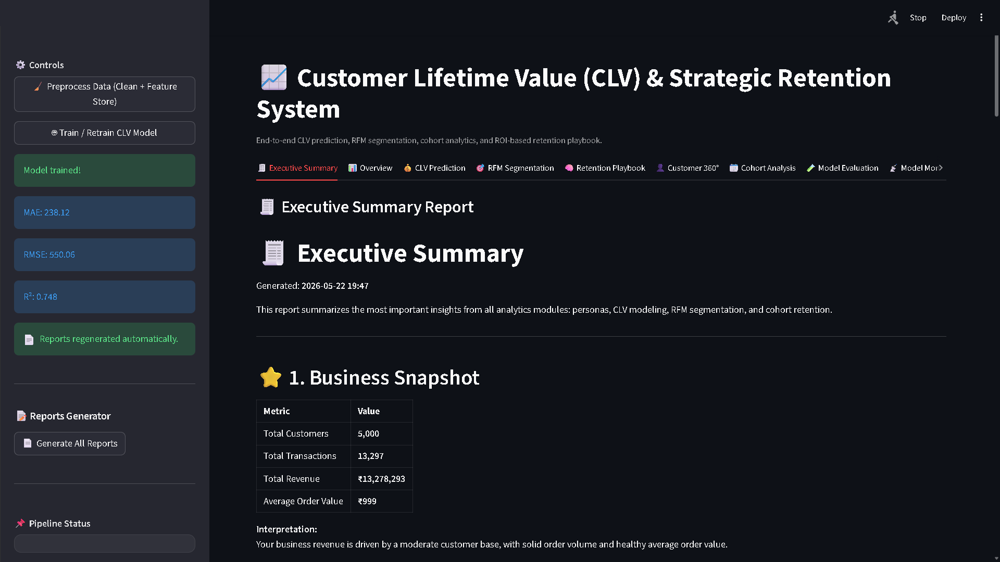

<br/>
<i>Customer Intelligence Platform for Lifetime Value Analytics, Segmentation, Retention Strategy & Business Decision Support</i>

<br/>


</div>

---

# 🖼️ Project Overview

An AI-powered customer intelligence platform designed to predict customer lifetime value (CLV), segment customers using RFM analytics, identify high-value customer groups, and support retention-focused business decision-making through interactive analytics dashboards, monitoring workflows, and automated reporting systems.

This platform focuses on:
- Customer lifetime value analytics
- RFM-based customer segmentation
- Customer retention intelligence
- Cohort & behavioral analytics
- Customer profitability analysis
- Customer 360 insights
- Drift monitoring workflows
- Executive-ready analytics dashboards

Built using:
- Streamlit
- XGBoost
- Scikit-learn
- SHAP
- Plotly
- Pandas & NumPy

---

# 🚀 Key Business Capabilities

- Customer lifetime value prediction
- RFM customer segmentation
- Customer profitability analytics
- High-value customer identification
- Retention strategy intelligence
- Customer cohort analysis
- Drift detection & monitoring
- Auto-retraining workflows
- Executive reporting dashboards

---

# 💼 Business Problem

Businesses often struggle to:
- identify high-value customers early
- understand long-term customer profitability
- personalize retention strategies effectively
- optimize customer acquisition spend
- detect changing customer behavior patterns

Without customer intelligence workflows, organizations may face:
- inefficient marketing allocation
- lower retention rates
- reduced customer profitability
- poor customer prioritization
- ineffective engagement strategies

This project demonstrates how analytics-driven customer intelligence can support:
- customer value optimization
- retention-focused strategies
- customer segmentation workflows
- long-term business growth planning

---

# 📈 Business Impact

This platform helps organizations simulate and analyze:
- customer lifetime value trends
- high-value customer segments
- retention opportunity areas
- customer profitability insights
- behavioral customer intelligence

The platform demonstrates how analytics workflows can improve:
- customer retention strategies
- customer targeting precision
- marketing effectiveness
- customer relationship management
- long-term revenue optimization

---

# 🧩 Multi-Module Customer Intelligence Dashboard

| Module                | Function                                      |
|-----------------------|-----------------------------------------------|
| 📄 Executive Summary  | Business-level customer intelligence overview |
| 📊 Overview Dashboard | Revenue, transactions & customer KPIs         |
| 💰 CLV Prediction     | Predict long-term customer value              |
| 🎯 RFM Segmentation   | Customer segmentation analytics               |
| 🧹 Data Cleaning      | Automated customer data preprocessing         |
| 🤖 Model Training     | Train & refresh CLV prediction models         |
| 🧠 Retention Playbook | ROI-based retention workflows                 |
| 👤 Customer 360       | Unified customer intelligence profile         |
| 📆 Cohort Analysis    | Customer retention trends                     |
| 🧪 Model Evaluation   | ML diagnostics & explainability               |
| 📡 Model Monitoring   | Drift detection & retraining                  |
| 📈 Log Analytics      | Operational monitoring insights               |
| 📜 Logs Viewer        | Real-time logs & debugging                    |
| 🖥️ System Health     | Infrastructure & pipeline health              |
| 📄 Reports Preview    | Executive reporting workflows                 |

---

# 📸 Platform Screenshots

## ⭐ Customer Intelligence Dashboard

<div align="center">
  
</div>

---

## ⭐ Executive Customer Overview

<div align="center">
  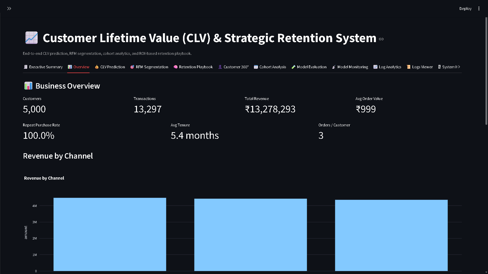
</div>

---

## ⭐ Customer 360 Intelligence

<div align="center">
  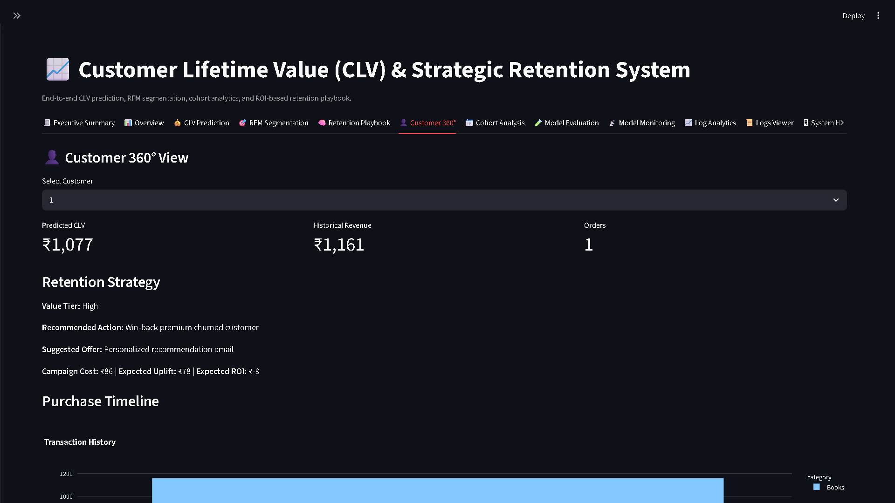
</div>

---

## ⭐ CLV Prediction Dashboard

<div align="center">
  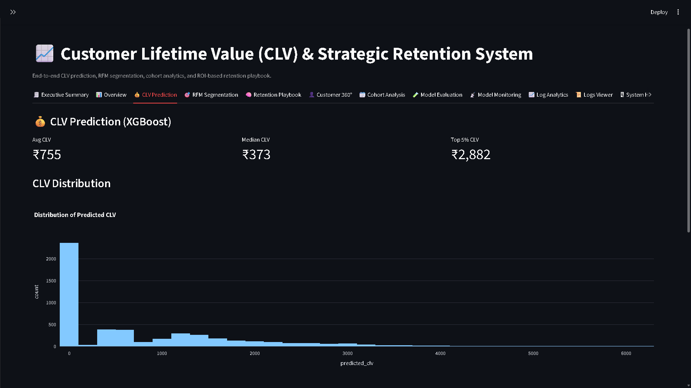
</div>

---

## ⭐ RFM Customer Segmentation

<div align="center">
  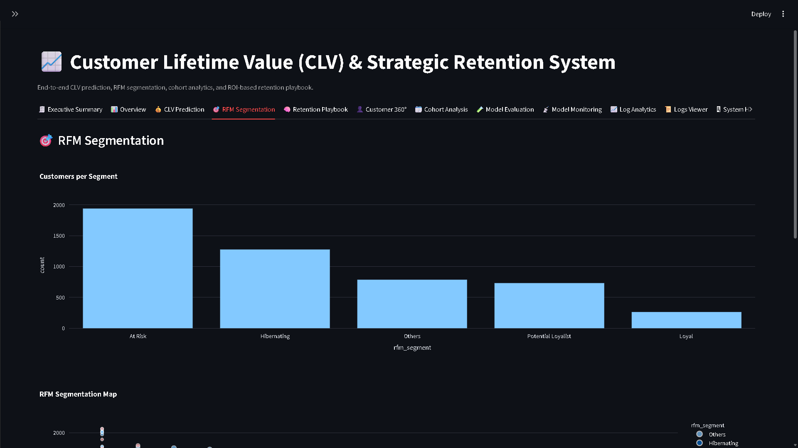
</div>

---

<details>

<summary>View Additional Dashboard Screens</summary>

<br/>

## ⭐ Cohort Analytics

<div align="center">
  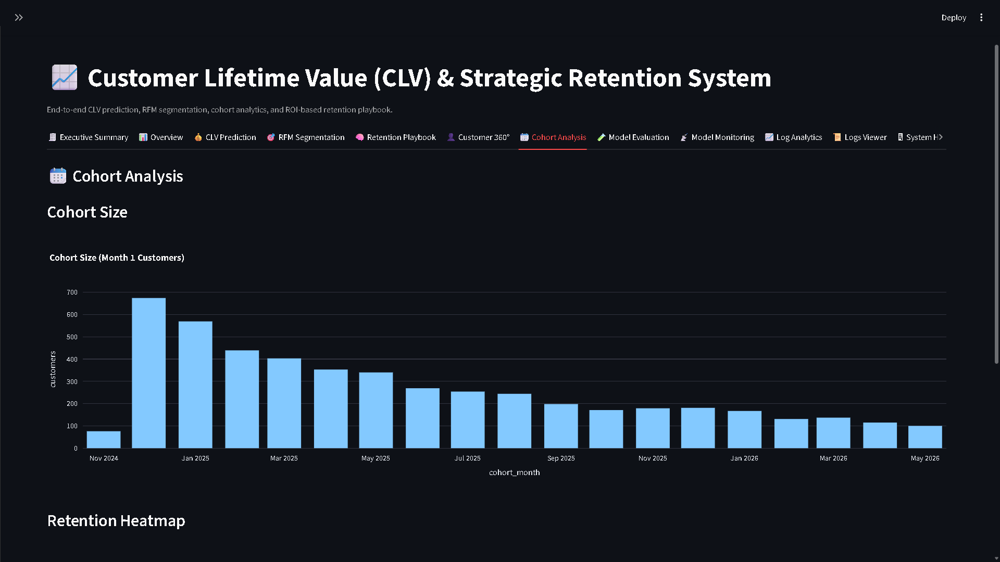
</div>

---

## ⭐ Retention Intelligence Workflows

<div align="center">
  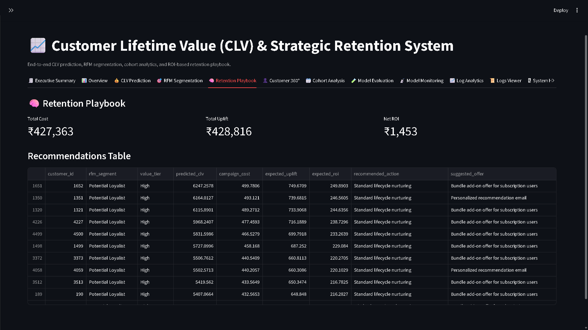
</div>

---

## ⭐ Executive Summary Dashboard

<div align="center">
  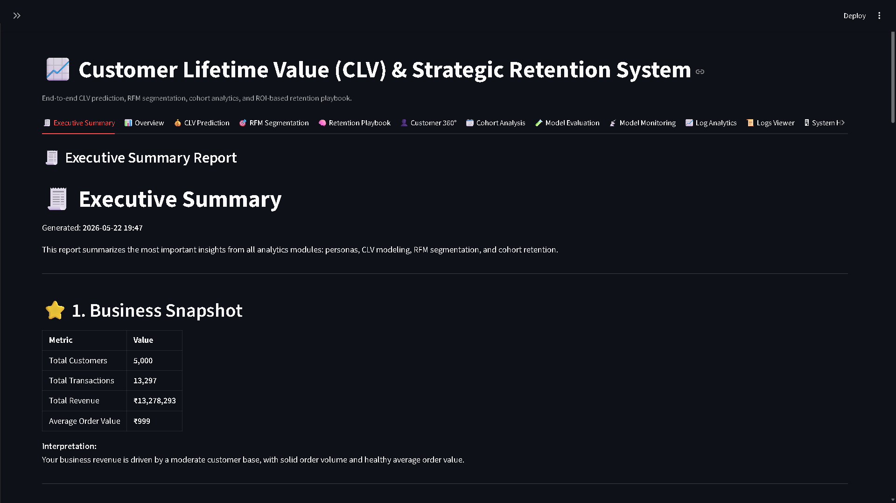
</div>

---

## ⭐ Model Evaluation Dashboard

<div align="center">
  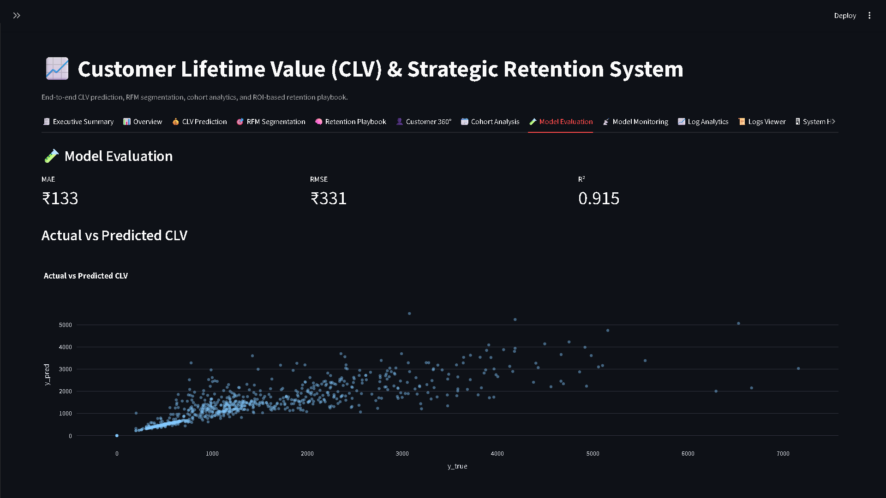
</div>

---

## ⭐ Model Monitoring System

<div align="center">
  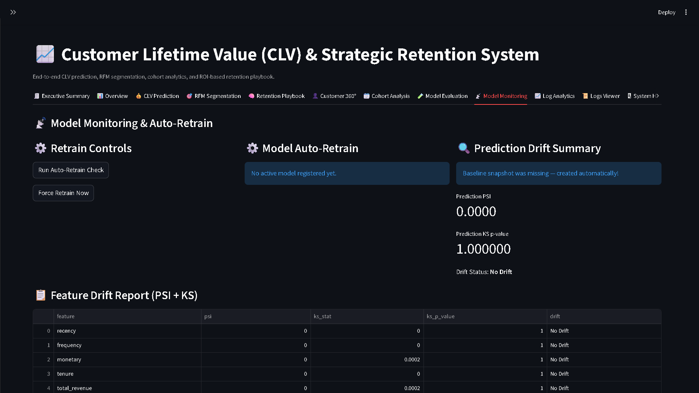
</div>

---

## ⭐ Reports Preview System

<div align="center">
  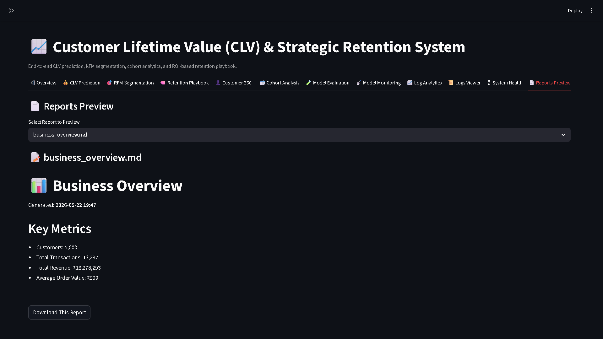
</div>

---

## ⭐ Log Analytics Dashboard

<div align="center">
  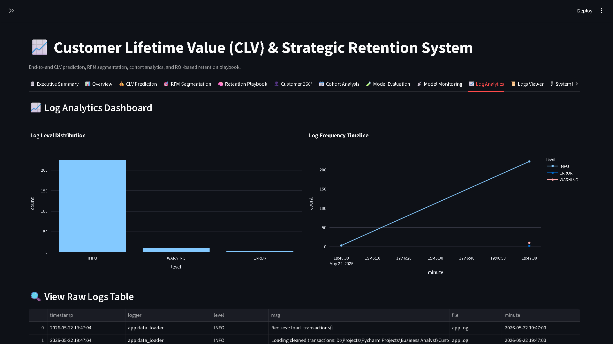
</div>

---

## ⭐ Logs Viewer

<div align="center">
  
</div>

---

## ⭐ System Health Monitoring

<div align="center">
  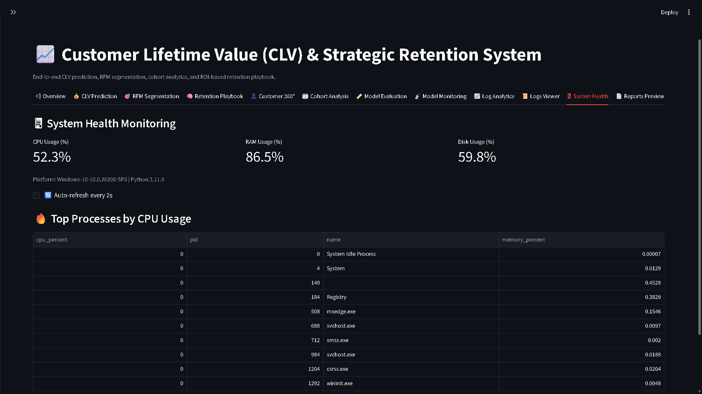
</div>

---

## ⭐ Sidebar Workflow Automation

<div align="center">
  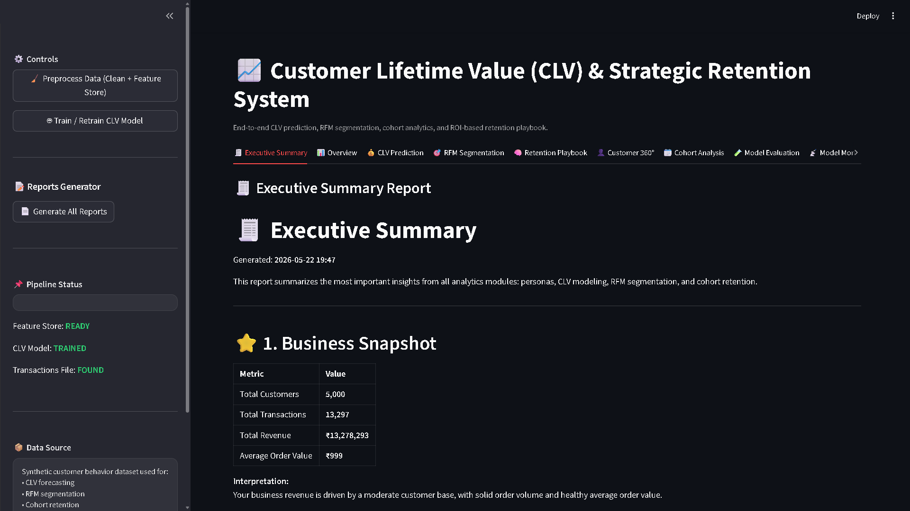
</div>

</details>

---

# 📊 Key Customer Intelligence Insights

The analysis revealed several important customer value patterns:

### 🔹 High-frequency customers generated stronger lifetime value

Customers with higher purchase frequency consistently contributed higher long-term revenue.

### 🔹 RFM segmentation improved customer prioritization

RFM analytics helped identify:
- loyal customers
- high-value customers
- at-risk customers
- inactive customer groups

### 🔹 Customer behavior patterns shifted over time

Cohort analysis revealed changing customer engagement and purchasing behavior trends.

### 🔹 SHAP explainability improved interpretability

SHAP analysis highlighted the strongest factors driving customer lifetime value.

### 🔹 Drift monitoring improved model reliability

Behavioral drift detection helped identify evolving customer patterns.

These insights supported:
- retention strategy optimization
- customer targeting workflows
- customer profitability analysis
- long-term customer intelligence systems

---

# 🧬 Customer Intelligence Workflow

```text
Customer Transaction Data
            ↓
Synthetic Data Generation
            ↓
Data Cleaning & Feature Engineering
            ↓
RFM Segmentation Pipeline
            ↓
CLV Prediction Models
            ↓
Customer 360 Intelligence Layer
            ↓
SHAP Explainability & Cohort Analytics
            ↓
Drift Monitoring & Auto Retraining
            ↓
Interactive Streamlit Dashboard
            ↓
Executive Reporting & Retention Intelligence
```

---

# 🧩 End-to-End Workflow

1. Generate synthetic customer transaction datasets
2. Clean and preprocess customer features
3. Perform RFM customer segmentation
4. Train customer lifetime value models
5. Generate customer intelligence insights
6. Analyze cohorts and behavioral patterns
7. Monitor customer behavior drift
8. Refresh models through retraining workflows
9. Explore interactive customer intelligence dashboards
10. Generate executive-ready reports

---

# 🧠 Tech Stack

| Category         | Technologies              |
|------------------|---------------------------|
| Language         | Python 3.10+              |
| Data Analysis    | Pandas, NumPy             |
| Machine Learning | XGBoost, Scikit-learn     |
| Explainability   | SHAP                      |
| Visualization    | Plotly, Matplotlib        |
| Dashboard/UI     | Streamlit                 |
| Reporting        | pdfkit, wkhtmltopdf       |
| Monitoring       | Logging & Drift Detection |
| Testing          | PyTest                    |
---

# 📁 **Project Structure**

```
Customer-Lifetime-Value-Analytics-System/
│
├── app/
│   ├── auto_retrain.py
│   ├── clv_model.py
│   ├── cohort_analysis.py
│   ├── data_loader.py
│   ├── drift_simulator.py
│   ├── generate_reports.py
│   ├── log_analytics.py
│   ├── logging_config.py
│   ├── log_utils.py
│   ├── model_evaluation.py
│   ├── model_monitoring.py
│   ├── model_registry.py
│   ├── monitoring_viz.py
│   ├── pdf_generator.py
│   ├── preprocess.py
│   ├── retention_recommender.py
│   ├── rfm_segmentation.py
│   ├── streamlit_app.py
│   ├── system_health.py
│   └── utils.py
│
├── data/
│   ├── config/
│   │   └── synthetic_config.py
│   │   
│   ├── raw/
│   ├── processed/
│   └── synthetic_generator.py
│
├── logs/
├── models/
│
├── reports/
│   ├── business_insights.md
│   ├── clv_summary.md
│   ├── executive_summary.md
│   ├── executive_summary.pdf
│   ├── persona_insights.md
│   └── rfm_report.md
│
├── screenshots/
│   ├── clv_tab.png
│   ├── cohort_tab.png
│   ├── customer_360.png
│   ├── dashboard_overview.png
│   ├── executive_summary.png
│   ├── log_analytics.png
│   ├── log_viewer.png
│   ├── model_evaluation.png
│   ├── model_monitoring.png
│   ├── overview_tab.png
│   ├── reports_preview.png
│   ├── retention_tab.png
│   ├── rfm_tab.png
│   ├── showing_sidebar.png
│   └── system_health.png
│
├── tests/
│   ├── conftest.py
│   ├── test_clv_model.py
│   ├── test_cohort.py
│   ├── test_data_loader.py
│   ├── test_evaluation.py
│   ├── test_model_evaluation.py
│   ├── test_model_monitoring.py
│   ├── test_monitoring.py
│   ├── test_preprocess.py
│   ├── test_recommender.py
│   ├── test_reports.py
│   └── test_rfm.py
│   
├── requirements.txt
└── README.md
```

---

# ⚙️ Installation

## 1️⃣ Clone Repository

```bash
git clone https://github.com/girishshenoy16/Customer-Lifetime-Value-Analytics-System.git
cd Customer-Lifetime-Value-Analytics-System
```

---

## 2️⃣ Create Virtual Environment

```bash
python -m venv venv
venv\Scripts\activate
```

---

## 3️⃣ Install Dependencies

```bash
python.exe -m pip install --upgrade pip
pip install -r requirements.txt
```

---

## 4️⃣ Install wkhtmltopdf (Required for PDF Reports)

Download and install wkhtmltopdf:

[wkhtmltopdf Official Download Page](https://wkhtmltopdf.org/downloads.html)

After installation, ensure wkhtmltopdf is added to your system PATH.

This is required for:
- PDF report generation
- executive summary exports
- downloadable analytics reports

---

# ▶️ Running the Project

## 1️⃣ Generate Synthetic Customer Dataset

Before launching the dashboard, generate the synthetic customer transaction dataset:

```bash
python data/synthetic_generator.py
```

This automatically:
- creates synthetic customer transaction data
- prepares raw datasets
- initializes analytics workflows
- prepares dashboard-ready pipelines

This produces:

* `data/raw/customers_transactions.csv`
* `data/processed/customer_status.csv`
* `data/processed/cart_events.csv`

---

## 2️⃣ Launch Streamlit Dashboard

```bash
streamlit run app/streamlit_app.py
```

---

# 🧰 Important Dashboard Workflows

After launching the dashboard, complete these workflows from the Streamlit sidebar:

---

## ✔ Run Data Cleaning Pipeline

Use the sidebar option:

➡️ Run Data Cleaning Pipeline

This:
- preprocesses customer records
- handles missing values
- prepares modeling datasets
- refreshes feature engineering workflows

---

## ✔ Train CLV Prediction Models

Use the sidebar option:

➡️ Train / Refresh CLV Models

This:
- trains XGBoost CLV models
- refreshes prediction pipelines
- updates model registry artifacts
- prepares customer intelligence workflows

---

## ✔ Generate Executive Reports

Use the Reports section to:

➡️ Generate Business Intelligence Reports

This automatically creates:
- executive summaries
- customer segmentation reports
- cohort analytics exports
- downloadable reporting assets

---

After completing these workflows, all dashboard modules become fully functional.

---

# 🧪 Testing the Project

Run all tests:

```bash
pytest -q
```

Run verbose tests:

```bash
pytest -v
```

The testing suite includes:
- CLV model tests
- segmentation tests
- drift monitoring tests
- dashboard tests
- reporting workflow tests
- data integrity validation

---

# 🔮 Future Scope

- Real-time customer intelligence pipelines
- Advanced recommendation systems
- Multi-channel customer analytics
- Automated retention campaign orchestration
- Deep learning-based CLV forecasting
- Cloud deployment & API integration
- Enterprise CRM integration workflows

---

# 🤝 Contribution

Contributions, suggestions, and improvements are welcome.

If you found this project valuable, consider starring the repository.

---

<div align="center">

### ⚡ Customer Intelligence & Lifetime Value Analytics for Smarter Retention Strategies

</div>